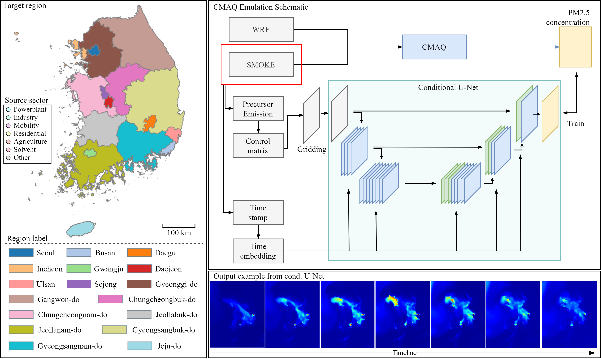

# Conditional U-Net for CMAQ PM2.5 Emulation

[](https://www.python.org/downloads/)
[](https://www.tensorflow.org/)
[](https://opensource.org/licenses/Apache-2.0)
[](https://www.linux.org/)

## Overview



This repository contains the implementation of a Conditional U-Net architecture for high-speed emulation of CMAQ (Community Multiscale Air Quality) simulations, specifically for PM2.5 concentration prediction in South Korea. The model achieves a remarkable computational speedup of approximately 288,000x compared to traditional CMAQ simulations while maintaining high fidelity ($R^2 > 0.99$).

**Paper**: "Emulating CMAQ Simulations with a Conditional U-Net: A Data-Driven Approach for PM2.5 Concentration Prediction" (Under review at Scientific Reports)

## ⚠️ Important Notices

### Data and Model Availability
**The training data and pre-trained models are NOT included in this repository.** They are protected under a Korean government research project and cannot be publicly distributed. This repository provides:
- The model architecture and training framework
- Code for training your own models with your data
- Example usage patterns and evaluation scripts

To use this code, you will need to:
1. Prepare your own CMAQ simulation data
2. Format it according to the specifications in the documentation
3. Train the model using the provided scripts

### Platform Compatibility
**This code has been developed and tested exclusively on Linux (Ubuntu 22.04).** While the code may work on other platforms, we cannot guarantee compatibility or provide support for:
- Windows
- macOS  
- Other Unix-like systems

For best results, please use a Linux environment with CUDA-capable GPUs.

## Key Features

- **Ultra-fast inference**: Generates PM2.5 predictions in 0.3 seconds (GPU) vs ~24 hours for CMAQ
- **High accuracy**: $R^2 > 0.99$ correlation with CMAQ simulations across all seasons
- **Policy-relevant inputs**: Uses emission source activity levels (7 sectors x 17 regions) as inputs
- **Temporal dynamics**: Predicts hourly PM2.5 concentrations with sinusoidal time encoding
- **Interpretable**: SHAP analysis reveals physically meaningful emission-concentration relationships

## Model Architecture

The model consists of:
1. **Gridding Layer**: Converts 119-dimensional control matrix to spatial grid (82x67x7)
2. **Conditional U-Net**: Encoder-decoder architecture with skip connections
3. **Time Embedding**: Sinusoidal positional encoding for temporal information
4. **Output**: Hourly PM2.5 concentration maps (82x67 grid cells)

## Installation

### System Requirements
- **Operating System**: Linux (Ubuntu 20.04+ recommended)
- **Python**: 3.8 or higher
- **CUDA**: 11.2+ (for GPU acceleration)
- **Memory**: Minimum 16GB RAM (32GB+ recommended)
- **GPU**: NVIDIA GPU with 8GB+ VRAM (optional but highly recommended)

### Installation Steps (Linux)
```bash
# Clone the repository
git clone https://github.com/[your-username]/cmaq-unet-emulator.git
cd cmaq-unet-emulator

# Create virtual environment
python3 -m venv venv
source venv/bin/activate

# Install dependencies
pip install --upgrade pip
pip install -r requirements.txt
```

### Core Dependencies
- Python 3.8+
- TensorFlow 2.14+ (with GPU support)
- NumPy 1.19+
- Pandas 1.3+
- scikit-learn 1.0+
- netCDF4 1.5+ (for data processing)

## Usage

### Training the Model

```python
from cmaqnet.model import get_unet_model
from cmaqnet.dataloader import load_cmaq_data

# Load data
X_ctrl, X_time, y_pm25 = load_cmaq_data(season='January')

# Create and train model
model = get_unet_model(
    input_shape=(119,),
    output_shape=(82, 67, 1),
    time_dim=128
)

model.fit(
    [X_ctrl, X_time], 
    y_pm25,
    epochs=300,
    batch_size=256,
    validation_split=0.2
)
```

### Making Predictions

```python
# Load trained model
model = tf.keras.models.load_model('models/cmaq_unet_pm25.h5')

# Prepare control matrix (7 sectors � 17 regions)
control_matrix = prepare_control_matrix(
    power_plants=0.8,  # 80% of baseline
    industry=1.0,       # 100% of baseline
    mobile=0.7,         # 70% of baseline
    # ... other sectors
)

# Predict PM2.5 for specific time
time_step = 100  # Hour index
pm25_map = model.predict([control_matrix, time_step])
```

### Scenario Analysis

```python
from cmaqnet.scenarios import EmissionScenario

# Define emission reduction scenario
scenario = EmissionScenario()
scenario.set_reduction('power_plants', regions=['Seoul', 'Gyeonggi'], factor=0.5)
scenario.set_reduction('mobile', regions='all', factor=0.8)

# Generate predictions
results = scenario.evaluate(model, time_range=(0, 984))
print(f"Average PM2.5 reduction: {results.mean_reduction:.2f} �g/m�")
```

## Data Structure

### ⚠️ Data Availability Notice
**The original training data and pre-trained models are NOT available for download.** They are protected under Korean government project regulations and cannot be publicly distributed.

### Required Data Format (You Must Provide Your Own)

To use this code, you need to prepare your own CMAQ simulation data:

#### Input Data
- **Control Matrix**: CSV file with emission control factors
  - Dimensions: 119 (7 emission sectors × 17 regions) 
  - Sectors: Power plants, Industry, Mobile, Residential, Agriculture, Solvents, Others
  - Regions: Define based on your study area
  - Values: Activity levels (typically 0.5-1.5× baseline)
  - Format: `(n_scenarios, 119)`

#### Target Data  
- **PM2.5 Concentrations**: NumPy array from CMAQ simulations
  - Spatial: Your CMAQ domain grid (we used 82×67)
  - Temporal: Hourly values
  - Format: `(n_scenarios, n_hours, height, width, 1)`
  - Units: µg/m³

#### Data Preparation Example
```python
# You need to create data in this format:
control_matrix = pd.DataFrame(...)  # Shape: (119 scenarios, 119 features)
control_matrix.to_csv('datasets/control_matrix.csv')

pm25_data = np.array(...)  # Shape: (119, 984, 82, 67, 1)
np.save('datasets/pm25_concentrations.npy', pm25_data)
```

## Model Performance

| Season | Time Resolution | MAE ($\mu g/m^2$) | MeanNE (%) | $R^2$ |
|--------|----------------|-------------|------------|-----|
| Winter | Hour | 0.26 | 2.88 | 0.999 |
| Spring | Hour | 0.27 | 2.59 | 0.999 |
| Summer | Hour | 0.21 | 2.86 | 0.999 |
| Fall | Hour | 0.19 | 3.30 | 0.998 |

## Citation

If you use this code in your research, please cite:

```bibtex
@article{lee2024emulating,
  title={Emulating CMAQ Simulations with a Conditional U-Net: A Data-Driven Approach for PM2.5 Concentration Prediction},
  author={Lee, Yohan and Park, Junghyun and Kim, Jinseok and Woo, Jung-Hun and Lee, Jong-Hyeon},
  journal={Scientific Reports},
  year={2024},
  note={Under review}
}
```

## License

This project is licensed under the Apache License 2.0 - see the [LICENSE](LICENSE) file for details.

## Acknowledgments

This research was supported by the Korea Institute of Environment and Industrial Technology (Project No: RS-2022-KE002096).

## Contact

For questions and feedback:
- Corresponding Author: Jong-Hyeon Lee (j.lee@ehrnc.com)
- Institution: EH Research & Consulting Co., Ltd.

## Disclaimer

This is a research prototype for demonstrating the feasibility of using deep learning for CMAQ emulation. Comprehensive validation against observational data is ongoing and required before operational deployment.